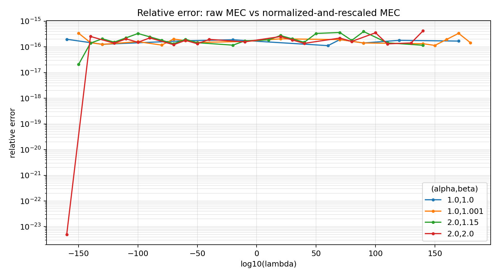

# MEC Normalization Report

This report documents correctness and stability checks for the new public API
behavior where `normalize_weights=False` by default.

Supporting artifacts:

- Data: [mec_normalization/report_data.json](/Users/ulvenforst/Codex/University/pol_measures/benchmarks/mec_normalization/report_data.json)
- Plot: [mec_normalization/scaling_relative_error.png](/Users/ulvenforst/Codex/University/pol_measures/benchmarks/mec_normalization/scaling_relative_error.png)

## Scope

The relevant implementation points are:

- [`PolarizationMeasure.__call__`](/Users/ulvenforst/Codex/University/pol_measures/src/measures/base.py#L103)
- [`validate_histogram`](/Users/ulvenforst/Codex/University/pol_measures/src/measures/validation.py#L14)
- The regression test for the motivating case in [`test_mec.py`](/Users/ulvenforst/Codex/University/pol_measures/tests/metrics/proposed/test_mec.py#L74)

The current semantics are:

- `MEC(x, w)` preserves raw masses by default.
- `MEC(x, w, normalize_weights=True)` computes the value for the normalized
  distribution `\bar{\pi}`.
- `MEC.compute(x, w)` also preserves raw masses, but skips the public input
  preprocessing. In particular, `__call__` still rescales `x` to `[0,1]` by
  default while `compute` does not.

## Identities

There are two correct rewritings, and they should not be conflated.

### 1. Normalizing `pi` directly

\[
\MEC_{\alpha,\beta}(\pi)=\Mass(\pi)^\alpha\,\MEC_{\alpha,\beta}(\overline{\pi})
\]

Here the factor is `Mass(pi)^alpha`.

### 2. Absorbing `alpha` into the masses

If \(\rho=\overline{\pi^\alpha}\) and \(D_\beta(\rho)=\MEC_{1,\beta}(\rho)\), then

\[
\MEC_{\alpha,\beta}(\pi)=\Mass(\pi^\alpha)\,D_\beta(\rho)
\]

Here the factor is `Mass(pi^alpha)`.

Both formulas are compatible:

\[
\Mass(\pi)^\alpha \MEC_{\alpha,\beta}(\overline{\pi})
=
\Mass(\pi^\alpha) D_\beta(\overline{\pi^\alpha})
=
\MEC_{\alpha,\beta}(\pi)
\]

## Exact User-Facing Cases

I reproduced the two cases closest to the motivating example.

### Case A: `alpha=1`, `beta=1`

With

\[
x=(0,\tfrac{7}{12},1), \qquad
\pi=(\tfrac{5}{7}, \tfrac{1}{20}, \tfrac{5}{7})
\]

the implementation returns:

- Public default raw: `0.7142858090619997`
- Public normalized: `0.4830918515395167`
- Direct raw `compute`: `0.7142858090619997`
- Rescaled normalized value:
  \[
  \Mass(\pi)^\alpha \MEC(\overline{\pi}) = 0.7142858090619998
  \]
- Dispersion route:
  \[
  \Mass(\pi^\alpha) D_\beta(\overline{\pi^\alpha}) = 0.7142858090619998
  \]

### Case B: `alpha=1`, `beta=1.001`

With

\[
x=(0,\tfrac{7}{12},1), \qquad
\pi=((\tfrac{5}{7})^{1.001}, \tfrac{1}{20}, \tfrac{5}{7})
\]

the implementation returns:

- Public default raw: `0.7136607304982818`
- Public normalized: `0.48274754904416606`
- Direct raw `compute`: `0.7136607304982818`
- Rescaled normalized value:
  \[
  \Mass(\pi)^\alpha \MEC(\overline{\pi}) = 0.7136607304982818
  \]
- Dispersion route:
  \[
  \Mass(\pi^\alpha) D_\beta(\overline{\pi^\alpha}) = 0.7136607304982818
  \]

These two exact cases confirm that the theorem explains the scale change
precisely: the old public behavior was returning \(\MEC(\overline{\pi})\), not
\(\MEC(\pi)\).

## Random Correctness Tests

I ran 1000 random cases per parameter pair with:

- fixed seed `20260329`
- `n` sampled in `{3,4,5,6,7}`
- sorted supports in `[0,1]` with endpoints fixed at `0` and `1`
- masses sampled log-uniformly as `exp(U[-6,6])`

For each case I compared:

1. `raw = MEC(alpha,beta)(x,w)`
2. `Mass(pi)^alpha * MEC(alpha,beta)(x,w, normalize_weights=True)`
3. `Mass(pi^alpha) * MEC(1,beta)(x, overline(pi^alpha))`

### Summary

| `(alpha,beta)` | max rel. err. via `Mass(pi)^alpha` | max rel. err. via `Mass(pi^alpha)` | p95 rel. err. via `Mass(pi)^alpha` |
| --- | ---: | ---: | ---: |
| `(1,1)` | `2.29e-06` | `2.29e-06` | `8.81e-16` |
| `(1,1.001)` | `3.19e-06` | `3.19e-06` | `1.05e-15` |
| `(2,1.15)` | `4.66e-06` | `1.95e-09` | `4.25e-16` |
| `(2,2)` | `5.37e-16` | `4.38e-16` | `3.59e-16` |
| `(0.7,1.4)` | `8.74e-16` | `5.63e-16` | `3.17e-16` |

### Reading

- In ordinary ranges, both formulas are numerically sound.
- The median and 95th percentile errors are essentially at machine precision.
- The rare worst cases appear near the non-smooth regime around `beta=1`.
- For `(alpha,beta)=(2,1.15)`, the dispersion route
  `Mass(pi^alpha) * D_beta(overline(pi^alpha))` was materially more stable in
  the worst sampled case than the direct rescaling from `\bar{\pi}`.

This suggests the theorem is correct and useful computationally, but the choice
of intermediate representation can still affect the optimizer's numerical path.

## Extreme Scaling Stress Test

I fixed

\[
x=(0, 0.23, 0.61, 1), \qquad \pi_0=(0.4,0.1,0.2,0.3)
\]

and evaluated the relation under \(\lambda \pi_0\) for
\(\lambda=10^k\), \(k\in\{-180,-170,\dots,180\}\).

Finite representability ranges observed:

- `(1,1)`: finite for `lambda` in `[1e-180, 1e180]`
- `(1,1.001)`: finite for `lambda` in `[1e-180, 1e180]`
- `(2,1.15)`: finite for `lambda` in `[1e-180, 1e150]`
- `(2,2)`: finite for `lambda` in `[1e-180, 1e150]`

Within the finite range, the relative error between the raw route and the
normalized-and-rescaled route stayed at machine precision:

- `(1,1)`: max `1.98e-16`
- `(1,1.001)`: max `3.40e-16`
- `(2,1.15)`: max `3.95e-16`
- `(2,2)`: max `4.20e-16`

The stress plot is embedded below:

### Reading

- The theorem is numerically exact up to floating-point noise over a very wide
  scaling range.
- The practical limit is not the identity itself, but `float64` overflow and
  underflow when the true raw value leaves the representable range.
- The normalized route improves conditioning of the optimization problem, but it
  cannot rescue a final scalar that mathematically overflows `float64`.

## Conclusions

1. The normalization identities are correct.
2. The new API behavior matches the intended raw semantics:
   `MEC(x,w)` now computes raw MEC by default.
3. The old behavior remains available explicitly through
   `normalize_weights=True`.
4. In normal regimes there is no meaningful precision loss in recovering raw MEC
   from normalized MEC.
5. Near `beta=1`, the dominant issue is optimizer behavior on a non-smooth
   objective, not an error in the theorem.
6. If exactness at `beta=1` becomes important, the next technical improvement is
   not more normalization logic but a dedicated weighted-median path instead of
   `minimize_scalar`.
